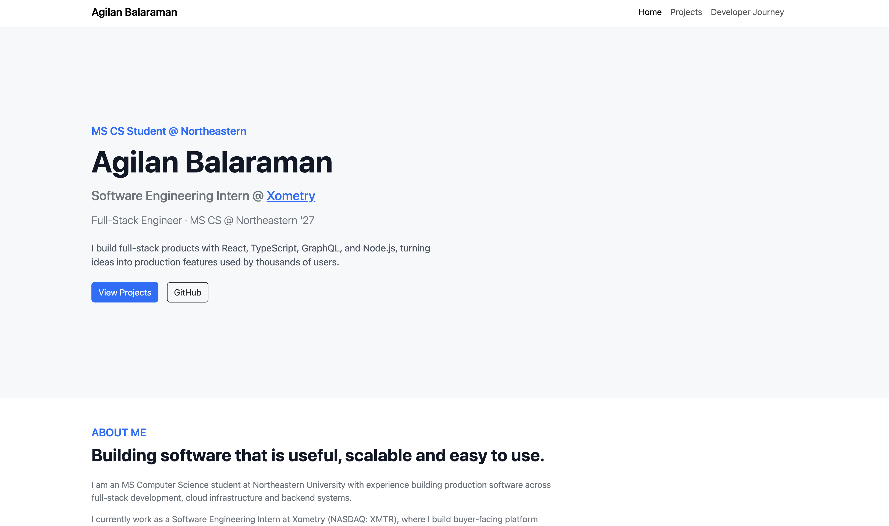
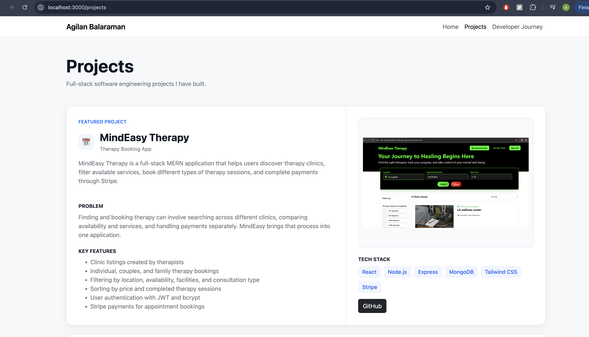
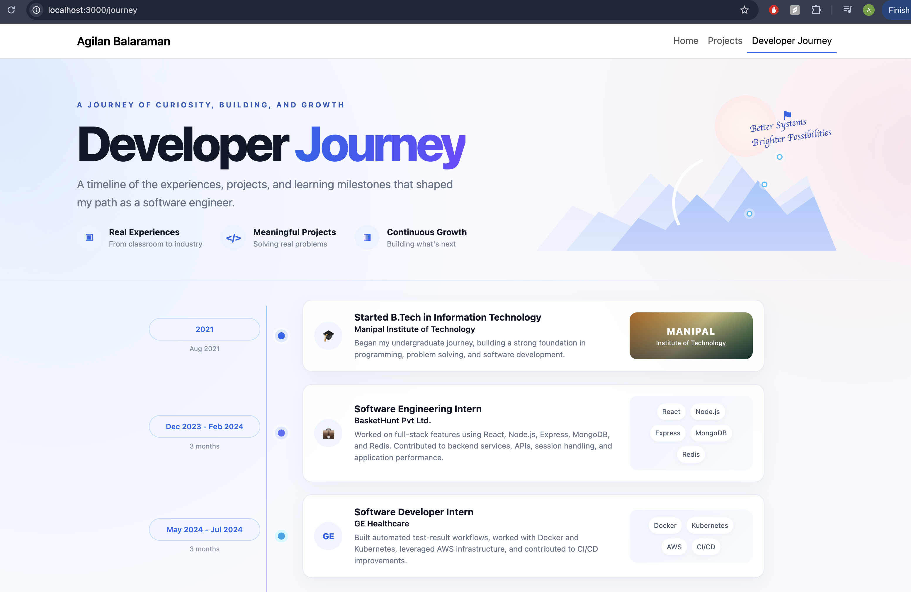

# Agilan Balaraman Portfolio

A personal software engineering portfolio showcasing my professional experience, projects, technical skills, coursework, and interests.

## Author

**Agilan Balaraman**

- GitHub: [agilan11](https://github.com/agilan11)
- LinkedIn: [Agilan Balaraman](https://www.linkedin.com/in/agilan-balaraman)
- BlueSky: [@agilan11.bsky.social](https://bsky.app/profile/agilan11.bsky.social)

## Project Objective

The goal of this project is to build a responsive personal homepage using vanilla HTML, CSS, JavaScript, and Bootstrap.

The portfolio presents my software engineering background in a format that is easier to explore than a traditional resume. It includes my professional experience, projects, technical skills, coursework, interests, and developer journey.

The site contains three pages:

- **Home**: overview of my experience, projects, skills, coursework, and interests
- **Projects**: detailed information about two full-stack applications
- **Developer Journey**: an AI-generated visual timeline of my education and software engineering experience

## Class

CS 5610 Web Development  
Northeastern University

[Course Website](https://johnguerra.co/classes/webDevelopment_online_fall_2026/)

## Screenshots

### Home Page



### Projects Page



### Developer Journey Page



## Features

- Responsive portfolio layout
- Three separate HTML pages
- Professional experience and project showcase
- Interactive "Explore My Work" filter
- Project screenshots and GitHub links
- Responsive Bootstrap grid
- Developer Journey timeline
- Scroll reveal animations
- Contact links for GitHub, LinkedIn, BlueSky, and email

## Original JavaScript Functionality

The homepage contains an interactive **Explore My Work** component.

Users can filter experience and project content using:

- All
- Full Stack
- Backend
- Cloud

JavaScript reads the category assigned to each item and dynamically hides or displays content based on the selected filter.

The Developer Journey page also includes a scroll reveal effect using the `IntersectionObserver` API.

## Technologies Used

- HTML5
- CSS3
- JavaScript ES6 Modules
- Bootstrap 5
- Node.js and npm for development tooling
- ESLint
- Prettier

## Project Structure

```text
agilan-portfolio/
├── css/
│   ├── main.css
│   └── journey.css
├── design-docs/
│   ├── mockups/
│   ├── wireframes/
│   └── design-document.md
├── images/
│   ├── favicon.png
│   ├── Therapy-Booking.png
│   ├── Organ-Transplant.png
│   ├── project-thumbnail.png
│   ├── home-page.png
│   ├── projects-page.png
│   └── journey-page.png
├── js/
│   └── main.js
├── index.html
├── projects.html
├── journey.html
├── eslint.config.js
├── package.json
├── README.md
└── LICENSE
```

## Design Documentation

The design process includes:

- Project description
- User personas
- User stories
- Wireframes
- Final design mockups

The complete design document is available here:

[Design Document](./design-docs/design-document.md)

## Installation and Running Locally

Clone the repository:

```bash
git clone https://github.com/agilan11/agilan-portfolio.git
```

Move into the project directory:

```bash
cd agilan-portfolio
```

Install development dependencies:

```bash
npm install
```

Start a local server:

```bash
python3 -m http.server 3000
```

Then open:

```text
http://localhost:3000
```

## Code Quality

Run ESLint:

```bash
npm run lint
```

Format the project using Prettier:

```bash
npm run format
```

Check formatting without modifying files:

```bash
npm run format:check
```

All HTML pages were also checked using the W3C HTML validator.

## Generative AI Disclosure

### ChatGPT

**Tool:** ChatGPT  
**Model:** GPT-5.6 Sol

ChatGPT was used to assist with:

- generating the AI-based Developer Journey page
- generating the README doc

Prompts:

> Generate a visually distinctive Developer Journey page that looks intentionally AI-generated while remaining responsive and implemented using HTML, CSS, Bootstrap, and JavaScript.

> Create a polished README.md for my personal software engineering portfolio project.

## Deployment

The portfolio is deployed using GitHub Pages.

Live site:

```text
https://agilan11.github.io/agilan-portfolio/
```

## Video Demo

Public narrated demonstration:

```text
https://youtu.be/1MbsoSLl5mk?si=v2ZdiWufFgi67v_Y
```

## License

This project is licensed under the MIT License.

See [LICENSE](./LICENSE) for details.
