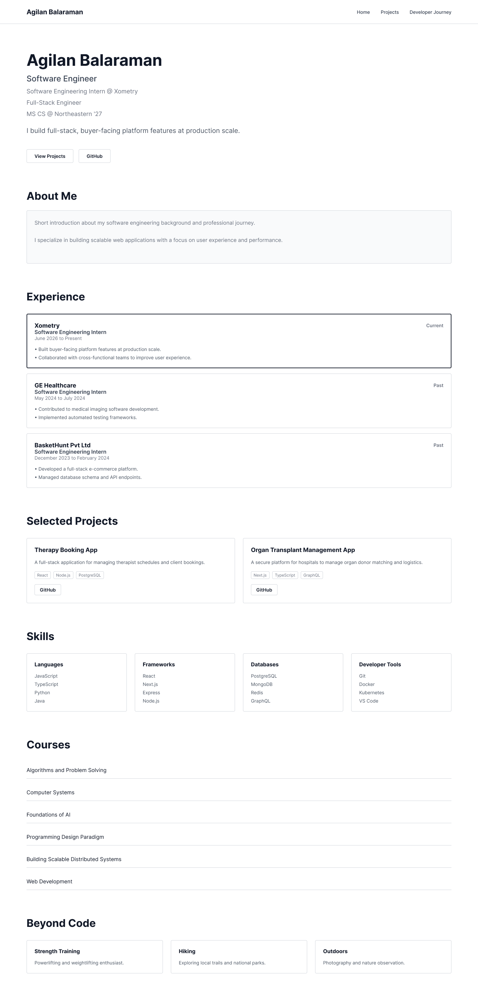
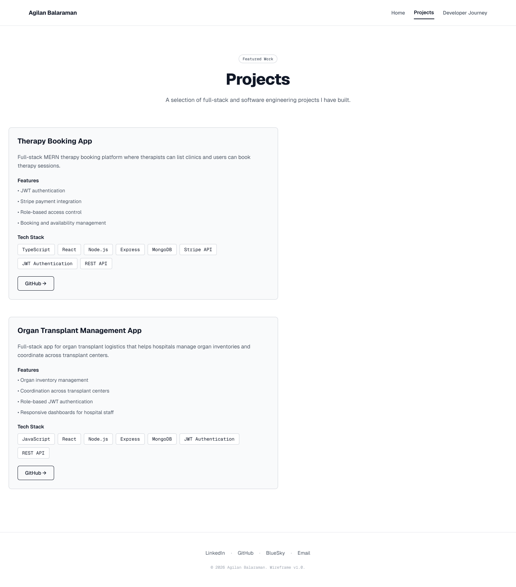
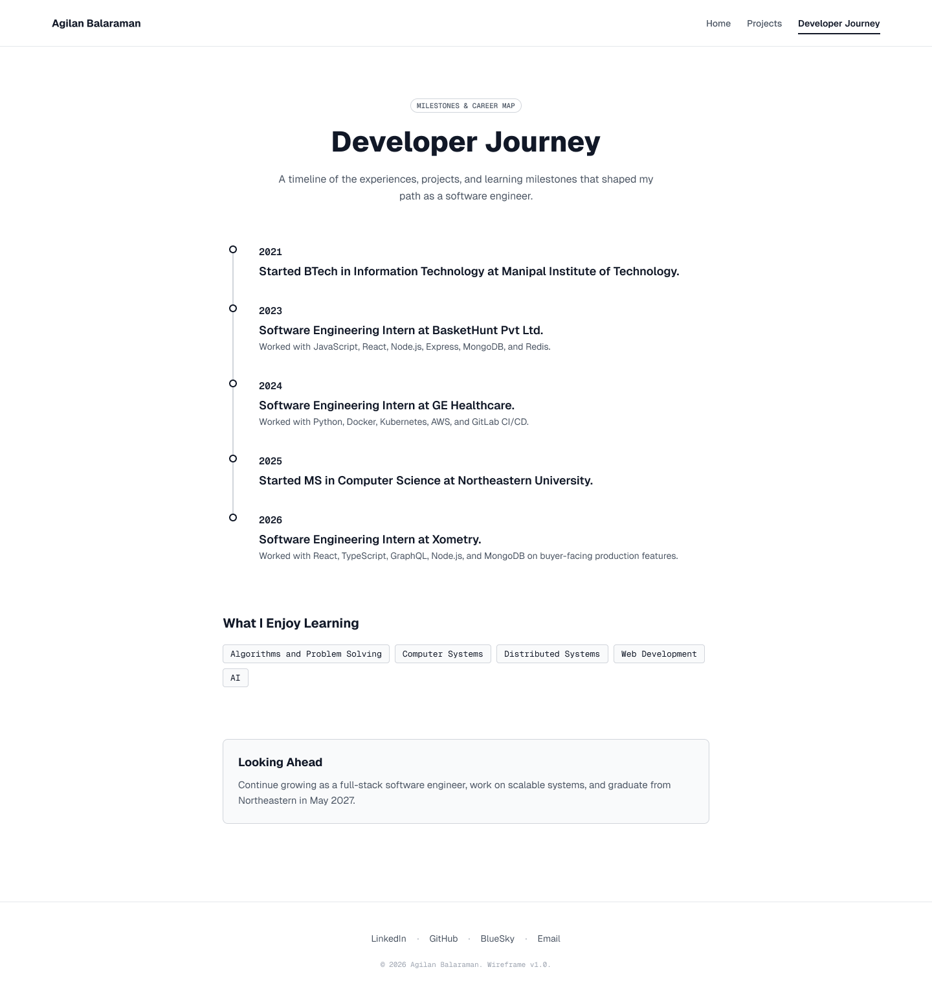
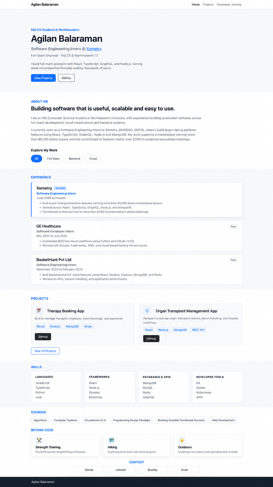
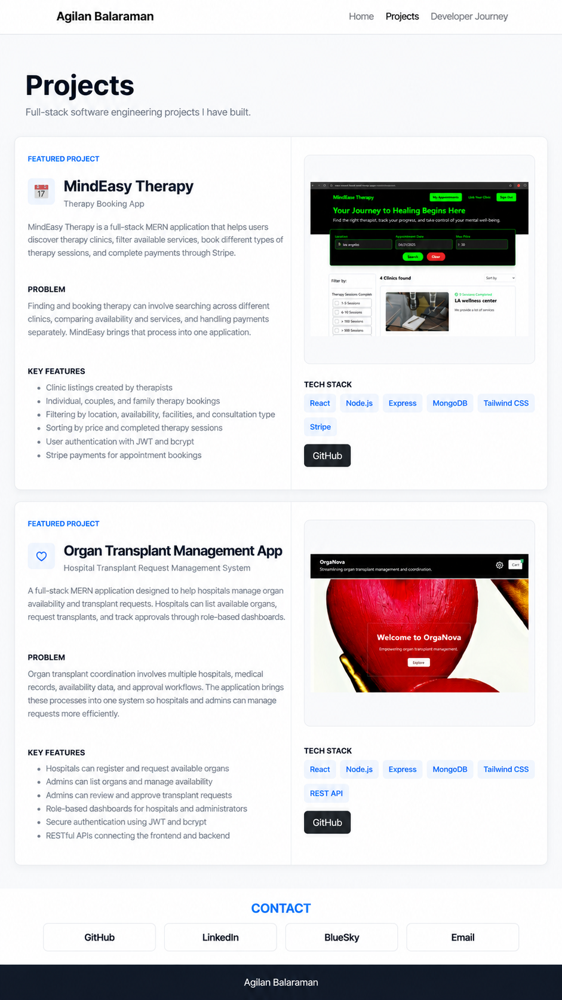
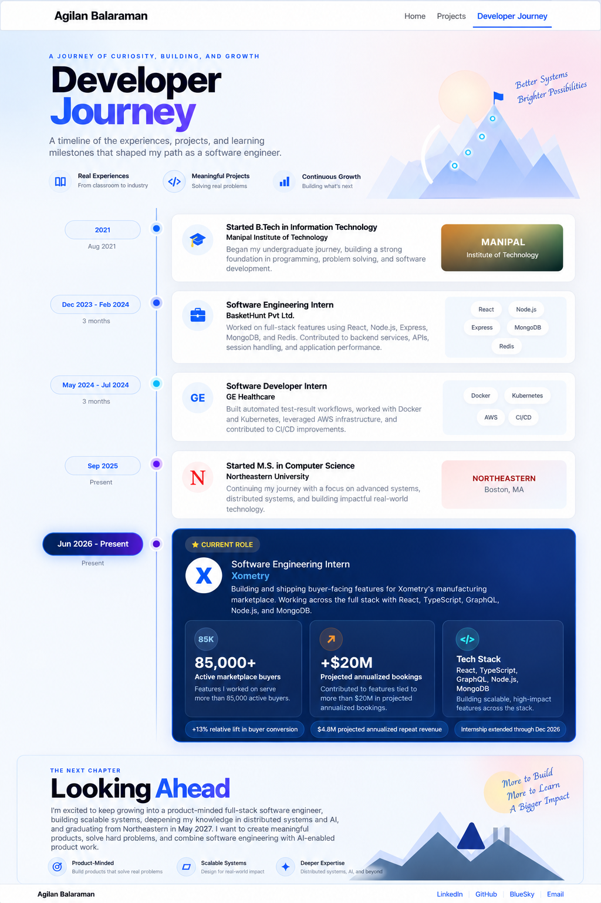

# Portfolio Design Document

**Author:** Agilan Balaraman

## Project Description

This portfolio is a personal software engineering portfolio designed to present my professional experience, technical skills, software projects, academic background, and interests in a clear and professional format.

The primary audience for the website is recruiters, hiring managers, software engineers, and other professionals who want a quick but meaningful overview of my background and work.

The homepage will highlight my current experience as a Software Engineering Intern at Xometry, where I work on full-stack, buyer-facing platform features using technologies such as React, TypeScript, GraphQL, Node.js, and MongoDB. My work includes building production features for a marketplace serving more than 85,000 active buyers.

The website will contain three main pages.

- **Home** - Provides an overview of my experience, selected projects, technical skills, coursework, and interests.
- **Projects** - Provides a deeper look at selected software projects and the technologies used to build them.
- **Developer Journey** - An AI-generated page that presents important milestones, learning experiences, and growth throughout my software engineering journey.

The visual design will be minimal, modern, professional, and responsive. The goal is to create a portfolio that is useful for recruiters and technical reviewers while still showing personality beyond a traditional resume.

## User Personas

### Persona 1: Technical Recruiter

**Name:** Maya  
**Role:** Technical Recruiter  
**Goal:** Quickly determine whether my background aligns with a software engineering role.

**Needs:**

- Understand my current role and education immediately
- See relevant technologies and technical skills
- Find measurable work impact
- View major projects
- Access GitHub and LinkedIn easily

**Pain Point:** Recruiters often have limited time to review each candidate, so important information should be easy to find quickly.

### Persona 2: Software Engineer or Hiring Manager

**Name:** Daniel  
**Role:** Senior Software Engineer  
**Goal:** Understand the technical depth behind my experience and projects.

**Needs:**

- See technologies used in real projects
- Understand what I personally built
- View project repositories
- See experience with full-stack systems, cloud infrastructure, and software engineering practices

**Pain Point:** A traditional resume often provides limited space to explain the technical reasoning and implementation behind a project.

### Persona 3: Student or Peer

**Name:** Alex  
**Role:** Computer Science Student  
**Goal:** Learn more about my background, coursework, projects, and interests.

**Needs:**

- Understand what areas of computer science I enjoy
- Explore my projects
- See courses and technologies I have worked with
- Learn about my interests outside software engineering

**Pain Point:** A purely professional portfolio can feel impersonal and may not show the interests and experiences behind the person.

## User Stories

- As a recruiter, I want to understand who Agilan is within a few seconds so that I can determine whether his background is relevant to an open role.
- As a recruiter, I want to see measurable impact from previous internships so that I can understand the scale of his work.
- As a hiring manager, I want to explore selected projects so that I can understand Agilan's technical skills beyond a resume.
- As a software engineer, I want links to GitHub repositories so that I can inspect the implementation of his projects.
- As a visitor, I want the website to work well on different screen sizes so that I can browse it from a laptop, tablet, or phone.
- As a visitor, I want consistent navigation between pages so that I can easily move between Home, Projects, and Developer Journey.
- As a peer, I want to see coursework and interests so that I can understand what areas of computer science Agilan enjoys.
- As a visitor, I want to see some personality beyond professional experience so that the portfolio does not feel like a resume copied into a webpage.
- As a recruiter, I want quick access to contact and professional profile links so that I can continue evaluating or reach out without searching elsewhere.
- As a technical reviewer, I want project technologies and responsibilities to be easy to scan so that I can quickly understand Agilan's technical strengths.

## Design Mockups

### Wireframes

The wireframes show the planned structure and layout of each page before final visual styling is applied.

#### Home Page Wireframe

#### Projects Page Wireframe

#### Developer Journey Page Wireframe

### Final Design Mockups

The final design mockups show the intended visual direction of the portfolio, including color palette, typography, spacing, cards, navigation, and overall page hierarchy.

Minor content details may evolve during implementation while preserving the overall visual structure and design system shown in these mockups.

#### Home Page Final Design Mockup

#### Projects Page Final Design Mockup

#### Developer Journey Page Final Design Mockup

